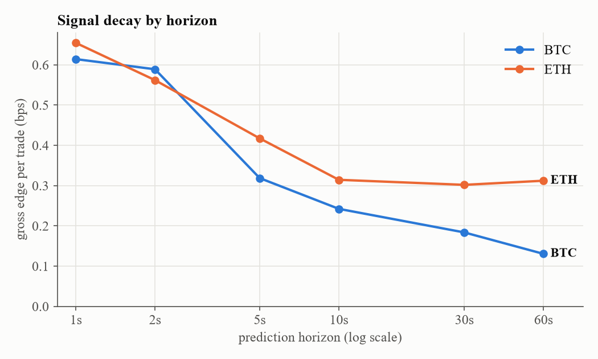
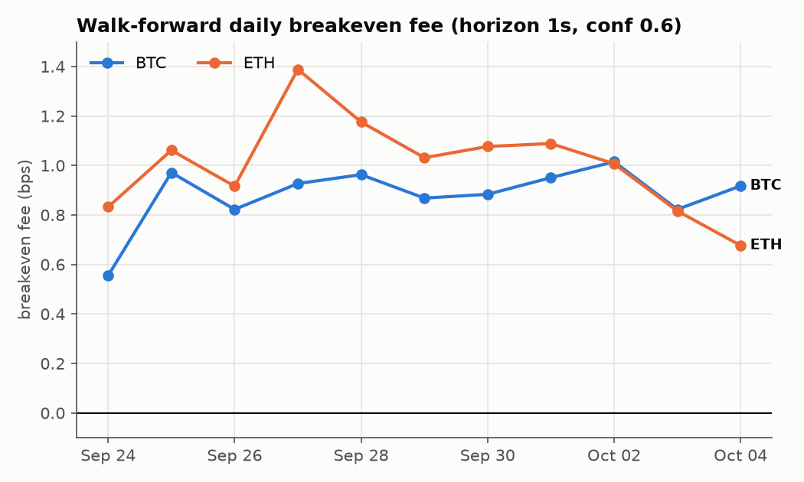
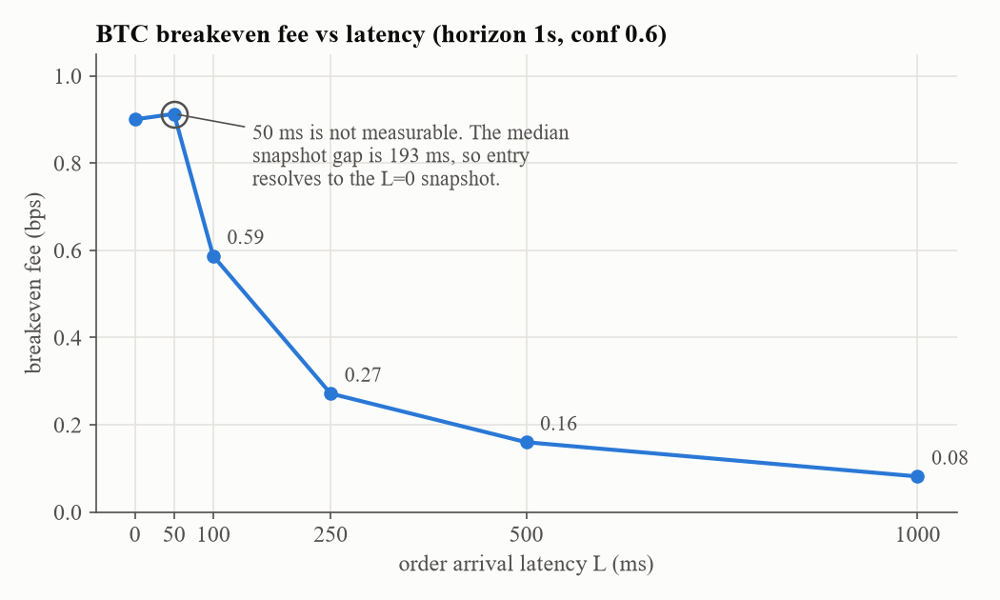

# Crypto Market Microstructure Terminal

Does order flow imbalance predict short-horizon price movement on a retail crypto
venue — and if so, can a retail participant actually capture it?

**Short answer: yes, and no.** The signal is real, statistically robust, and
replicates across assets and days. It is also ~11x too small to clear retail
fees, and ~70% of its breakeven margin is consumed by 250ms of network latency.
Two independent mechanisms, each sufficient on its own, put it out of reach.

---

## Data

| | BTCUSDT | ETHUSDT |
|---|---|---|
| Source | Binance.US L2 order book (`depth20@100ms`) + aggregate trades | same |
| Period | 21 Sep – 4 Oct 2026 (310 hours continuous) | same |
| Rows | 3.44M | 3.64M |
| Median book snapshot gap | 193 ms | 106 ms |
| Median spread | 0.04 bps | 0.333 bps |

Self-collected via a 24/7 websocket collector (`collect.py`). Public market data
only — no API keys, no order placement anywhere in this repo.

## Method

**Features** per book snapshot: queue imbalance at 1/5/20 levels, order flow
imbalance (Cont, Kukanov & Stoikov 2014), microprice deviation, distance-weighted
book pressure, signed trade flow over 1/5/10s, realized volatility, spread.

**Label:** forward mid return over the prediction horizon, bucketed to
down/flat/up with a deadband of max(spread/2, 0.5 bps) — a move only counts as
directional if it cleared half the spread and at least 0.5 bps. With a median BTC
spread of 0.04 bps the 0.5 bps floor binds almost always, which is why ~49% of BTC
rows are labeled flat (at the default 10s labeling horizon).

**Model:** LightGBM multiclass, chronological splits with an embargo equal to the
prediction horizon at each seam. Raw price levels are excluded as features.

**Validation:** expanding-window walk-forward, retraining daily, evaluating only
on the held-out next day. 11 test days per symbol.

## Results

### 1. Signal decay by horizon

Gross edge per trade (bps):

| horizon | 1s | 2s | 5s | 10s | 30s | 60s |
|---|---|---|---|---|---|---|
| BTC | 0.614 | 0.589 | 0.319 | 0.242 | 0.184 | 0.130 |
| ETH | 0.654 | 0.562 | 0.417 | 0.314 | 0.302 | 0.312 |

Edge is concentrated at 1–2 seconds and decays monotonically on BTC. ETH flattens
near 0.3 bps beyond 10s; with overlapping windows inflating significance at long
horizons, this difference is not something to build on.



### 2. Walk-forward robustness (horizon 1s, confidence 0.6)

| | BTC | ETH |
|---|---|---|
| Trades | 18,906 | 27,877 |
| Gross edge | 0.962 bps | 1.104 bps |
| Spread paid | 0.062 bps | 0.074 bps |
| **Breakeven fee** | **0.900 bps** | **1.031 bps** |
| Hit rate | 0.879 | 0.875 |
| Days with positive edge | 11/11 | 11/11 |
| Daily breakeven (mean ± sd) | 0.881 ± 0.124 | 1.006 ± 0.193 |
| Trend slope | +0.016 bps/day (t=1.42) | −0.020 bps/day (t=−1.09) |

Positive every day on both assets, with no significant trend. ETH's median spread
is 0.333 bps but spread paid was 0.074 bps, so the model trades disproportionately
when spreads are tight — a selection effect, not a cost saving. Neither symbol's
breakeven approaches a realistic taker fee.



### 3. Latency sensitivity (BTC)

Signal is generated at time *t*; a real order arrives at *t+L*.

| L | gross (bps) | breakeven (bps) | days with positive breakeven¹ |
|---|---|---|---|
| 0 | 0.962 | 0.900 | 11/11 |
| 50 ms | 0.976 | 0.913 | 11/11 |
| 100 ms | 0.777 | 0.587 | 11/11 |
| 250 ms | 0.429 | 0.272 | 11/11 |
| 500 ms | 0.293 | 0.160 | 11/11 |
| 1 s | 0.199 | 0.082 | 9/11 (Sep 30 and Oct 4 negative) |

By 250ms, breakeven fee falls 70% (0.900 → 0.272) and gross edge falls 55%
(0.962 → 0.429). **The 50ms row is an artifact**: with a median
snapshot gap of 193ms, sub-100ms entry almost always resolves to the same snapshot
as L=0, so real sub-100ms decay is not measurable with this data.

¹ Days on which the walk-forward breakeven fee was positive, from
`models/btcusdt_latency_daily.csv`. The `days_positive` column in
`models/btcusdt_latency.csv` counts gross-positive days instead (11/11 at every
latency) — a different measure.



### 4. Conditional analysis — a null

Gross edge sits at 0.7–0.95 bps across every realized-volatility quintile and
book-depth tercile, with no pattern. There is no regime where the signal becomes
large enough to trade. An apparent hour-of-day effect was 24 trades and is noise.

## Conclusion

Order book imbalance predicts BTC and ETH mid-price direction at 1–2 second
horizons with a hit rate near 0.88 and gross edge near 1 bps. The effect
replicates across two assets, is positive on 11 of 11 walk-forward days, and
shows no decay over the sample period.

It is not capturable by a retail participant:

1. **Fees.** Breakeven is ~0.9–1.0 bps round-trip against retail taker fees an
   order of magnitude larger.
2. **Latency.** Most of the edge is consumed within 250ms, before a retail order
   could reach the venue.

The edge clears costs only at fee levels near zero and latency well under 100ms —
i.e. for a colocated market maker, not someone on home internet. The high hit rate
is consistent with a known mechanical effect (the mid ticks toward the heavier
side of the book) rather than with a tradeable forecast.

## Limitations

- Gross edge is measured mid-to-mid. Queue position and adverse selection at the
  touch are not modeled; both would reduce realized edge further.
- Market impact is not modeled. Valid at small size only.
- Overlapping prediction windows inflate naive t-statistics. Daily walk-forward
  blocks are used as the primary robustness evidence instead.
- Both symbols' walk-forward windows cover the same calendar period, so
  cross-asset agreement is not independent across time.
- One venue, one 310-hour window, two assets.

## Reproducing

```bash
python -m venv .venv
source .venv/bin/activate                    # Windows: .venv\Scripts\activate
pip install -r requirements.txt
python collect.py --symbol btcusdt           # stream (run for days)
python collect.py --symbol btcusdt --label   # forward returns + deadband labels
python train.py --symbol btcusdt --sweep     # decay curve
python walkforward.py btcusdt                # daily walk-forward
python latency.py btcusdt                    # latency sensitivity
python docs/charts.py                        # README charts from models/*.csv
streamlit run app.py                         # terminal: Findings / Replay / Live tabs
```

A one-day sample (2026-10-03 UTC, both symbols) of raw collector chunks is included
in `data/sample/`. The labeling step reads `data/raw_*.parquet`, so copy the sample
there first:

```bash
cp data/sample/*.parquet data/
python collect.py --symbol btcusdt --label
python train.py --symbol btcusdt --horizon 1
```

One day is enough for labeling and a single train/val/test split. `walkforward.py`
and `latency.py` skip the first three days, so they need the full dataset (or
several days of your own collection). The full 530MB dataset is not committed.

The BTC decay table was verified to reproduce exactly (max difference 0.0 across
all columns of `models/btcusdt_sweep.csv`) by rerunning
`python train.py --symbol btcusdt --sweep` with the current committed code.
